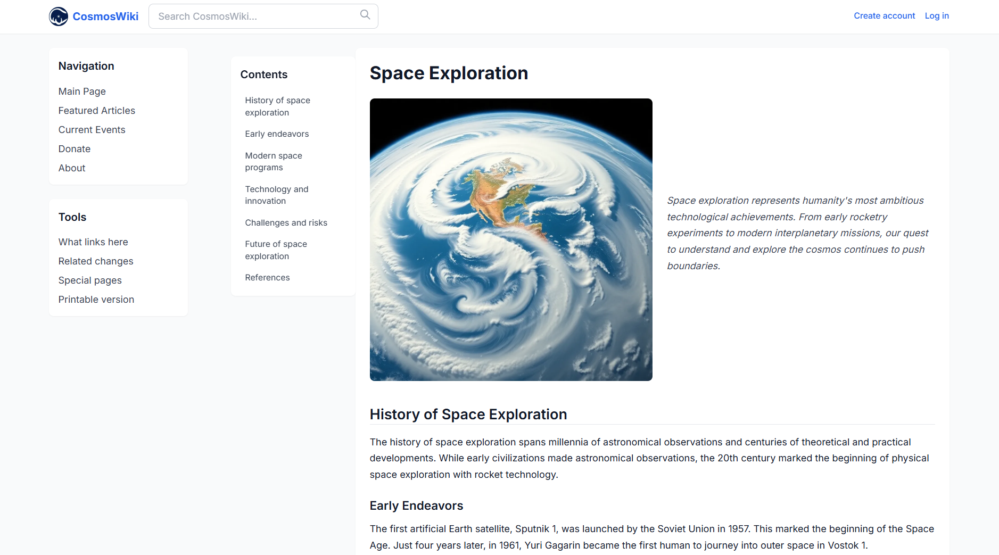

# CosmosWiki (BlackBoxAI) 

"CosmosWiki" is an online collaborative encyclopedia project designed as a highly extensible, user-driven repository of knowledge. Inspired by Wikipedia, CosmosWiki empowers users worldwide to create, edit, and maintain articles on nearly any subject, fostering a culture of open access, accuracy, and community engagement.

## Live Project :  
https://AICOMp-sketch.github.io/CosmosWiki/Source%20Code